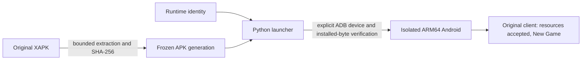

# ForeverEden: frozen Android client baseline

September 26, 2026. The original **Another Eden Global 3.17.0 / 699 ARM64**
client now reaches **New Game after completing Download All** on the Surface Pro 11, in a separate
**MuMuPlayerARM 1.8.5.0 / Android 12 (API 32)** instance named
**ForeverEden 3.17.0**. Earlier testing reached Initial Settings on 10 of 10 cold starts.
The original client subsequently rendered its opening story scene. This proves
installation, startup, rendering and resource acceptance on this machine,
not complete gameplay or reliable anti-cheat behavior. No gameplay patches or
mod APK were installed.

The updater initially requested **10,414.7 MB**. The user confirmed **United States
and Japanese voices**. Its live manifests select generation `ec741d3...`, PKM
textures, which differs from the packaged research generation. Parallel resource
preloading completed **119,259 Android files / 10.93 GB**, with zero final hash,
size or ownership mismatches. The original client accepted them and rendered
New Game. Root Access is Off and all original APK splits remain unchanged;
temporary in-process tuning was abandoned after exits. The final 1.66 GB preload
averaged 7.74 MB/s, including verification/publication.
See [DOWNLOAD_INVESTIGATION.md](DOWNLOAD_INVESTIGATION.md).

A separate **ForeverEden** package now accepts local login and game-ID responses,
displays a private account ID and loads the captured checkpoint
after local resource metadata and an encrypted profile pull. The private APK,
SDK state and sanitized profile use one fixed local-only identity. Its bounded
gameplay saves commit and replay after restart; live testing completed a quest,
changed areas and persisted the resulting tables. The untouched official package then still loaded the
same official checkpoint, proving the two accounts coexist without transfer or
migration. The listener recognizes 38 disassembled action names, but only 18 have
non-stub semantics; four necessary gameplay routes are rejected until their full
state contracts are traced. Quest close, gift receive, Battle Rush and the three
Star Library reward paths now return the exact frozen-client operation types and
parameter fields, retain those operations across restart, and remove them only
after a matching client acknowledgement. Paid battle continuation costs 50 Chronos Stones. Dungeon-key
purchase accepts the client's original `gamelibConsume` ID, debits its exact
20/40-stone row, persists the acquired key amount and returns the nested ticket
fields decoded by the callback. Dreams draws spend local Chronos Stones and use the exact
3.17.0 pools. The real frozen client has persisted battle, quest, treasure,
area and key-dungeon entry/exit deltas and resumed the same state after restart.
Publisher account, migration, social, advertising and subscription semantics
are intentionally outside the local single-player scope. See
[LOCAL_LOGIN_REPORT.md](LOCAL_LOGIN_REPORT.md) for the
implementation, runnable tests and non-root capture boundary.

The preservation boundary is one frozen identity, original content, one state
authority and explicit unknowns. The tested Android path is playable, but the
necessary packet slice is not complete; Steam remains separate.

## Inventory and preservation boundary

| Item | Evidence / reuse boundary |
|---|---|
| Original input | `ANOTHER+EDEN+Global_3.17.0_APKPure.xapk`; SHA-256 `9593f4b56fefe6bb3a9627dd509abd7e23459404050aac6ad6c3600823bd04ff`. Original file remains untouched. |
| Frozen APK generation | `data/frozen-client/android-3.17.0-699-9593f4b56fef/`: base, asset pack, ARM64, English and mdpi splits. Each size and hash is pinned in the launcher. |
| Publisher certificate | All five APKs verify under SHA-256 `c71f2ed143755c587e2d719a762c87bf5512d134693e4ceee545874dfb4af697`. Source-container provenance limits are documented in `APK_COMPARISON.md`. |
| Shipped code | Five DEX files and fifteen ARM64 native libraries. `libapp.so` is 76,220,624 bytes, SHA-256 `2789c0f6bb570d168a14d836a36a3e3fc372c60c63a8e79730dc9c67bc78a1dc`. |
| Content | Original APK assets, including `assets/lua.zip` and `assets/master/master_data_bundled.enc`. The bundled master buffer and selected fields are decoded with original-routine comparison. Thirty-seven of 67,834 Lua-archive members are decoded offline: bootstrap, foundation, labels and chapter one. None were executed. The first treasure's script, native guard and selection are traced; full gameplay support remains unverified. See `CONTENT_RECOVERY.md`. |
| Runtime identity | `runtime-identity.json` pins the original APK baseline. `local-runtime-identity.json` separately pins recognized routes, non-stub routes, required untraced routes, the exact 3.17.0 lottery/reward catalogs and launcher sources. |
| Isolated Android data | New MuMu instance `vm2.gmadoa`; original MuMu profiles `vm0` and `vm1` preserved. The game has its own fresh application data here. No app-data reset occurred. |
| Other Android runtime | WSA was registered but servicing and refused its ADB connection. It was not repaired; the already installed MuMu ARM runtime worked. |
| Existing downloader | `preseed.py`, `preseed/`: parallel asset mirror and hash checks. Not yet an Android asset installer or private server. Four reproduced correctness/boundary defects must be fixed before materialization; see `REPOSITORY_REVIEW.md`. |
| Existing mirror | Earlier review verified 26,273 files / 225,764,123 bytes. Its historical manifests cannot become this client's effective content generation without matching build, region and hashes. |
| Packaged versus cached content version | The APK's Android-US manifests declare `898712559d6849e5247784fde1f65615237a2b3e`; the retained old Steam cache declares `5ddcd43bf71584f95c050b9a4d20c021aa3c7e25`. The completed Android cache instead matches `ec741d3cc2f29b867892b1ed16a7a59b40e3968d`, PKM, US/Japanese. All 119,259 non-PC asset files passed exact live-manifest hash and size checks. Earlier packaged-generation gameplay research must remain separate. |
| Discovery tools | `tools/snapshot.py` and `tools/diff_snapshot.py` remain useful for filesystem comparisons. Steam updater paths are not Android updater paths. |
| Mod analysis | `APK_MOD_ANALYSIS.md` and `APK_COMPARISON.md` establish four in-memory changes to player damage, attack, battle gold and treasure quantity. They supply negative cases, not authoritative replacement gameplay data. |
| Server / database / runtime bridge | `npm run listen` starts the host Node 24 listener, imports the selected User Manager profile and prior local state into a profile-specific SQLite database, reverses guest loopback port 28765 and launches the private client. It recognizes 38 of 39 exact-build actions and rejects untraced semantics; subscription-only key recovery is deliberately unreachable. It also serves 16 phases of local manifest metadata. Paid battle continuation, dungeon-key purchase and Dreams draws persist their original-data Chronos Stone debits; key amounts and returned `UserPC` progress persist in the same profile store. Direct Android-launcher startup remains a standalone atomic-JSON mode. |

Freezing uses explicit bounded ZIP members, validates their hashes in a staging
directory, then publishes the generation with an atomic rename. The active
identity is replaced atomically. `previous-runtime-identity.json` retains the
previous manifest; it is **not** an emulator/profile backup or a promise that
an older launcher still exists. Current original APKs remain available across
launcher revisions. Updating the launcher requires republishing its identity.
Saved profiles must bind to the same identity when a store is implemented.

Original APKs, derived binaries, frozen copies and machine evidence are ignored
by Git. Source changes have not been committed or pushed.

## Authority and data flow

Implemented startup flow:



The following ownership map separates implemented startup support from the
remaining proposed gameplay boundary.

| State / decision | Sole proposed authority | Current status |
|---|---|---|
| Transport, routing, sessions, scoped capabilities | One bounded server process | 38 actions recognized; 18 non-stub, four necessary gameplay actions fail closed pending complete state contracts, and excluded services are not implemented; private capability, bounds, ordering, operation redelivery, replay and rollback tested |
| Profile, inventory, progress, consumed claims, schema revision | Selected local profile store | All 207 tables, metadata and queued replies persist atomically; User Manager supports create/select/reset/restore/export/import; SQLite corruption fails closed |
| Immutable gameplay definitions | Exact-build content generation | Packaged and completed-download master buffers/selected fields recovered; five treasure records compared across both, full gameplay schema remains partial |
| Combat and ordinary reward decisions | Original frozen client using original data; server validates and commits its authenticated deltas | Real battle, quest, treasure and dungeon deltas accepted and retained; exact catalogs validate server-facing reward and Dreams identifiers |
| Original client's temporary battle/display state | Android client runtime | Original opening story rendered; private login accepted; never the sole authority for durable awards |
| Real authentication/log timestamps | Service clock | Current server uses UTC wall clock for response/log timestamps |
| Scenario/event time | Transactionally stored game-clock configuration | No global host-clock changes |
| Timeouts and durations | Runtime timers | Bounded Node HTTP timeouts; original client owns ordinary gameplay timers |
| Client routing and available features | Identity-bound compatibility ledger | Separate private package points its default game API at loopback; login accepted; original package unchanged |

Planned mutation path: authenticate → resolve the same identity/content and
committed profile → evaluate an immutable input snapshot → validate the proposed
delta → SQLite transaction with stale-state checks → commit → protocol-ordered
response/notifications. Runtime execution and socket I/O stay outside the
transaction. Captured official state is evidence, never an overlay on live saves.

No native bridge is justified yet. An Android ELF library cannot simply be
loaded as a Windows DLL. Establish one callable, useful capability before adding
a separate host process or translating native logic.

## Protocol and capability ledger

This is the complete ledger of the **currently observed boundary** plus the
explicitly proposed first flow. Rows with UNKNOWN have no implemented handler.
Operation names below are descriptive labels, not invented packet identifiers.

| ID / trigger | Classification / owner | Request → response types | Required state; mutations | Persistence | Ordering / retries | Evidence and test status |
|---|---|---|---|---|---|---|
| C0: read original bundled master asset | CODEC_ONLY: original content loader | Pinned `.enc` bytes → decrypted/decompressed master buffer; not a network message | Exact original library/constants and asset; writes only separate research output | No profile mutation | Local deterministic extraction; no wire retry semantics | `CONTENT_RECOVERY.md`, complete bounded zlib decode, source/output hashes |
| C1: decode selected master fields | CODEC_ONLY: original field routine | Ciphertext → string/integer payload bytes; descriptor and selected treasure fields mapped | Master initializer's exact-build codec setup; no gameplay mutation | None | Local deterministic codec | Ten original fields match isolated ARM64 execution and damaged ciphertext is rejected; 3,927 descriptor values match original JSON; five treasure fixtures recovered |
| C2: load selected original Lua sources | CODEC_ONLY: original content loader traced, offline reconstruction | Exact archive members → bounded AES/zlib → UTF-8 source | Original file-loader initialization; no Lua execution or profile mutation | Separate research files only | Deterministic local extraction | Thirty-seven sources decoded; original chapter-one reward script linked to its master record; pinned hashes and malformed-length/output-bound checks pass; `CONTENT_RECOVERY.md` |
| C3: construct and parse game HTTP messages | Captured startup contract; broader gameplay UNKNOWN | JSON for four startup routes, MessagePack profile pull | Client version/configuration, bootstrap vs queued IDs/sequences, encryption state | SQLite runtime/profile/metadata/reply records; original queue paths traced | Bootstrap 0/0 reuse; queued exact replay/order/rollback tests pass | `LOCAL_LOGIN_REPORT.md`; original wire fixtures and real local login |
| C4: encrypted HTTP body codec | CODEC_ONLY plus accepted login transport | Plaintext ↔ zlib plus 0–15 padding ↔ AES-256-CBC; request checksum MD5 | Original embedded codec inputs, fallback/bootstrap and login-issued IVs; explicit limits | Codec input/source hashes in local runtime identity | Deterministic framing; full authentication is separate | 17 original native fixtures and five captured encrypted responses pass; local login accepted |
| G0: currency setter guard | NATIVE_AUTHORITY limited to original guard instructions; client owner | Synthetic currency ID/current amount/new amount/signature → return or fatal guard path | Bounded property and diagnostic helpers; no live profile touched | None | Not a transport or settlement operation | Five isolated ARM64 cases pass in `original-currency-guard-check.json`; no full item caller, signature validity, server enforcement or real award proof |
| G1: treasure guard and selection | NATIVE_AUTHORITY limited to original guard/lottery instructions; client owner | State/interval → can-open; ordered weights and controlled PRNG word → selected pattern | Original first treasure has one 50-gold pattern and no respawn; property/time/PRNG inputs supplied by bounded helpers | None in isolated check | Consumed first treasure rejected; server replay/atomicity unproven | Four guard and seven selection cases pass in `original-treasure-claim-check.json`; full open/apply and signature lifecycle untested |
| L0: launch installed game | NATIVE_AUTHORITY: original client rendering; launcher owns process launch | Android activity intent → `am start -W` status; not a game-network packet | Exact five installed APKs; creates process | Guest app storage exists; profile semantics unknown | Launch status followed by process/screen observation; no network retry claim | `first-launch.json`, `initial-settings.png`, installed APK hash validation. Client/platform/packaging smoke passed |
| L1: Initial Settings region/country/voice | Native client settings; complete persistence schema UNKNOWN | UI selection → resource manifests | User confirmed United States and Japanese voices | Download cache checked; profile semantics UNKNOWN | Original client accepted complete cache | All 119,259 Android resource files match live generation ec741d3..., zero final size/hash/ownership mismatches; New Game rendered |
| P0: client version/configuration and content bootstrap | Recovered startup config; immutable local manifest metadata, original asset bytes | Captured login configuration and exact-generation manifest JSON | Build 699, US/Japanese, generation ec741d3... | Identity-bound server config and isolated private OverlayFS resource views | Local phase-1 metadata accepted; phase-1/2 view remount and 89,802 hashes verified | `LOCAL_LOGIN_REPORT.md`; original lower files unchanged; original app must stay stopped while views are mounted |
| P1: create/load local identity and session | SERVER_OWNED local HTTP startup; remote authentication incomplete | Empty login/game-ID requests → captured JSON shapes with private ID/capability | Fixed local-only identity shared by private APK, SDK state and sanitized profile | Atomic per-profile JSON state on device; host SQLite remains separate | Bootstrap reuse and explicit local pairing are bounded | Real non-root capture, private login and restart accepted; official and private identities coexist |
| P2: profile bootstrap and first area | SERVER_OWNED profile reads; broader profile semantics UNKNOWN | UserStatus in JSON login plus MessagePack profile pull, JSON confirm and metadata | Sanitized 207-table capture; currency signature semantics incomplete | Selected User Manager profile plus committed table overrides | Queued retry, stale/conflicting rejection and restart tests pass | Actual private client loaded the Mayor's House checkpoint and accepted movement input |
| P3: ordinary battle and settlement | Frozen client owns simulation; local server owns durable state | Authenticated `BattleEnded` delta → checked table-token response | Client submits original-runtime party, battle and reward state under the selected local identity | All changed tables and replay record commit atomically | Real retry after restart was accepted once; stale/conflicting requests reject | Real Karek Swampland battle changed and persisted battle/profile tables; live `UserParty` identity defect fixed |
| P4: treasure award | Frozen client owns original treasure rules; local server owns durable state | Authenticated `TreasureGet` delta → token/seed response | `UserTreasure` plus awarded inventory and consumed item/random tokens | One atomic save transaction | Exact replay/order/rollback covered by shared save path | Multiple real treasure claims persisted; original 3.17.0 treasure evidence remains in `CONTENT_RECOVERY.md` |
| G2: first-save timers and roaming rules | NATIVE_AUTHORITY limited to isolated original routines; current original master supplies constants and pools | Explicit clock/frame/RNG inputs and stored properties → timer/index, playtime, selection and reset eligibility | 900-second environment ticks; first pattern indices 0–19; three roaming locations and 21600-second respawn | No profile writes in the checker | Native boundary and rollover cases only; server authorization remains UNKNOWN | 26 cases pass in `first-gameplay-rules-check.json`; captured environment delta matches, but preserved living roaming row would not reset through the tested guard |
| P5: save and reconnect | Local server owns all 207 durable profile tables | One to 32 authenticated client deltas; bounded puts/deletes with table tokens | Local identity, table identity and current tokens required | Submitted table changes and encrypted replay record commit atomically | Exact replay, stale/conflicting rejection, rollback and restart pass | Real area, quest, battle, treasure, dungeon and UI saves returned 200 and reloaded after restart |
| P6: Continue migration-status reset | EXTERNAL_COMPATIBILITY | Authenticated empty `user/migration/status_reset` → `{"code":0}` | Private publisher migration explicitly disabled; imported migration flag zero | Queued sequence and reply commit only | Atomic exact replay before/after restart tested | Real private response accepted; untouched official account still loaded the same checkpoint afterward |
| E0: payments, publisher/social authentication and analytics | UNKNOWN reachability; EXTERNAL_COMPATIBILITY only after required terminal behavior is recovered | UNKNOWN | No third-party credentials required by local design | No invented official account state | UNKNOWN | SDK symbols identify code presence, not necessity or a working protocol |

No operation is classified PROVEN_UNREACHABLE without a reachable-call analysis.
The four CODEC_ONLY rows have concrete decoding evidence; names alone are insufficient.
No RULE_AUTHORITY is claimed until the exact original tables and rules are
available. APK signatures and local certificate responses do not authorize
economy changes. Keeping the original Android integrity code on disk is not
proof that every check executed successfully.

## First vertical slice and gates

Gates 1–5 below are now passed for the necessary scope, with ordinary combat
and reward calculation left in the frozen original client. Gate 6's duplicate
server-side combat validation is intentionally excluded from this local
single-player architecture.

1. **Download gate passed:** US/Japanese, current generation, every Android asset
   hash/size/owner verified, and original client reaches New Game. Continue
   gameplay/reliability testing. Diagnose actual failures before changing checks.
2. Trace only the startup/session/first-area/battle/one-treasure/save flow. Recover
   exact request/response types, serializers, bounds, encryption/compression,
   state fields, ordering and retries from this build. Keep unknowns in the
   ledger. Route only an isolated private client to a controlled endpoint.
3. Recover exact original content for **one** encounter and **one** treasure.
   Do not choose fabricated IDs, drops, damage formulas or starting balances.
   Prove the shipped battle capability or the minimum original-data rule path.
4. Implement one server process and SQLite for that recovered contract. Enforce
   capability scopes, bounded input, identity matching and transactional state.
   Pin a schema version. Back up before destructive migration, recover interrupted
   migrations, and prove rollback and stale-write rejection. Do not create a
   placeholder schema or generic-success endpoint before the contract exists.
5. Through the real frozen client: create/load local profile → bootstrap → enter
   the supported area → complete the encounter → claim its verified reward and
   treasure → save → restart both sides → observe the same correct state.
6. Reject impossible HP/stats/rewards, repeated claims and invalid order using
   recovered semantics. Prove no pre-commit mutation and no double grant after a
   committed response is lost. A final-only combat report may require additional
   verified inputs; it cannot support claims of full combat validation by itself.

The necessary local single-player slice has passed: frozen-client identity,
startup, full-profile storage, area movement, battle, quest, treasure, Dreams,
key-dungeon entry/exit and restart. Publisher migration, social, advertising,
subscriptions and remote authentication remain outside scope rather than being
treated as local gameplay requirements.

## Exact launcher and verification commands

Run from the repository root. Start **ForeverEden 3.17.0** in the existing MuMu
manager first. Read that instance's live ADB endpoint; its address can change.
This launcher deliberately does not guess a device or overwrite an existing app.

```powershell
$adbPath = 'C:\Main\Productivity\Coding\Android\Sdk\platform-tools\adb.exe'
$instanceState = Get-Content -Raw -LiteralPath 'C:\Program Files\Netease\MuMuPlayerARM\vms\vm2.gmadoa\misc\state.json' | ConvertFrom-Json
$deviceSerial = '{0}:{1}' -f $instanceState.AdbHost,$instanceState.AdbPort
& $adbPath connect $deviceSerial
python tools\test_forevereden_client.py
python tools\forevereden_client.py freeze --xapk 'C:\Users\moemy\Downloads\ANOTHER+EDEN+Global_3.17.0_APKPure.xapk'
python tools\forevereden_client.py verify
# Fresh isolated instance only: refuses to replace an installed package.
python tools\forevereden_client.py install --adb $adbPath --serial $deviceSerial
# Normal subsequent use:
python tools\forevereden_client.py status --adb $adbPath --serial $deviceSerial
python tools\forevereden_client.py launch --adb $adbPath --serial $deviceSerial
```

`verify` checks the local generation. `status` and `launch` additionally hash
every installed split on the selected Android device and reject a different
APK set. The first install already completed here; do not repeat it to reset
data. `launch` requires Android's explicit successful status and still does not
claim that gameplay or a network request succeeded.

Repeated-startup evidence can be reproduced with the retained local script below.
It **force-stops this game's process ten times** on the specified device, retains
app data, verifies installed bytes, relaunches, checks the PID and saves screenshots.
Run it only on the task instance while the game is idle.

```powershell
python data\forevereden-evidence\repeat_startup.py --adb $adbPath --serial $deviceSerial
& $adbPath -s $deviceSerial logcat -d -b crash -v threadtime
git diff --check
```

Native ARM64 Python is also installed at
`C:\Users\moemy\AppData\Local\Programs\Python\Python312-arm64\python.exe`.
The tools use only the standard library.

## Proof and remaining deliverables

| Category | Evidence / limit |
|---|---|
| Static | Runnable checks cover local payload tampering, changed installed APK rejection, identity hashing, atomic JSON replacement, preserving existing app data, wrong ABI, explicit device selection and missing successful launch status. They do not simulate power loss. |
| Packaging | Original five-split install succeeded in the new isolated guest. On-device APK SHA-256 values match the frozen generation. |
| Native/runtime | Original application started and reached the updater. Ten selected master fields, five currency-guard cases and seventeen AES/framing fixtures passed isolated original ARM64 execution with bounded external helpers. Combat and integrity-check coverage remain untested. |
| Client | Original Download All completed and opening story rendered: 119,259 Android files / 10.93 GB, generation ec741d3..., US/Japanese. The private client completed area, quest, battle, treasure, Dreams and key-dungeon entry/exit flows and resumed after restart. |
| Platform | Windows ARM64 Surface + this MuMu ARM/Android build only. Physical Android, Steam, Linux gameplay, host reboot and sleep/resume remain unverified. |
| Server runtime / wire / persistence | 38 frozen-client actions are recognized and 16 manifest phases are served. Tests prove untraced actions are rejected plus bounded reads, capability checks, 207-table atomic persistence, corruption rejection, rollback, queued replay/order and restart. Real gameplay deltas persist through the same path. |

Local evidence is in `data/forevereden-evidence/`: installed package details,
first-launch status (3,011 ms), empty first-launch crash buffer, screenshot,
platform and emulator hashes, exact packaged content-manifest metadata, and
repeated-startup results. The platform
fingerprint is a guest-reported value, not independent proof of hardware identity.
An empty Android crash buffer is bounded evidence, not a guarantee of no failures.

The first repeat run stopped on attempt 5: Android's exit record says the game
was stopped due to installation of `com.google.android.gms` at 20:11:36, matching
that package's update time. A separate Google services domain-verification
exception followed. This interruption is retained in `interrupted-startup.json`
and its crash/exit logs; it is not attributed to the game's anti-cheat.

After that dependency update, a short 10-start process check passed but its
two-second screenshots still showed the CRIWARE logo. A subsequent run in
`starts-20260926T001723Z/` waited 15 seconds per launch: **all ten captures were
visually reviewed and showed Initial Settings**, with live PIDs and no additions
to the crash buffer. Android's `TotalTime` median was **1,988 ms**; this measures
activity launch, not time to settings or gameplay. `visual-review.png` is the
contact sheet. Checks also passed under the installed native ARM64 Python 3.12.

Measured host: Snapdragon X1E80100, Windows build 28120.3032, Adreno X1-85 driver
31.0.137.0. `host.json` preserves raw platform fields; the registry's legacy
`ProductName` text says Windows 10, so it is not used to override the observed
Windows 11 build identity. Guest package updates are a runtime variable and must
be recorded when comparing later results.

Architecture, build identity, capability ledger, launcher instructions,
commands and explicit limitations are present. SQLite and atomic JSON storage,
checked backup/rebind and the bounded game-protocol server cover the necessary
local single-player flow. Broad reliability still requires a
30-minute interactive session, usable input/audio, two host restarts and
sleep/resume, with failures understood. A boot loop test alone cannot pass it.

## Paths to retire only after replacements are proven

- Steam-only instructions in `CLAUDE.md` and `tools/DISCOVERY.md`: retain as
  historical evidence until Android updater discovery and later Steam support
  have their own verified procedures.
- Historical phase-only manifest cache: preserve until source/version-aware
  cache identity is implemented and compared; never silently reuse it as current.
- Extracted APK analysis copies: keep until retained hashes and reproducible
  analysis establish they can be recovered from the preserved inputs.
- WSA installation and existing MuMu profiles: not declared obsolete; no removal
  is authorized or needed for this baseline.

Nothing in this list has been deleted.
